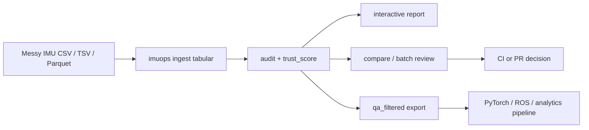
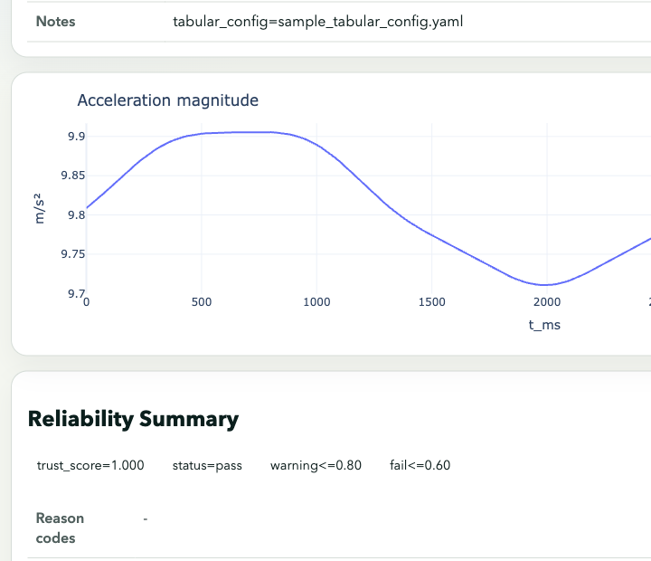
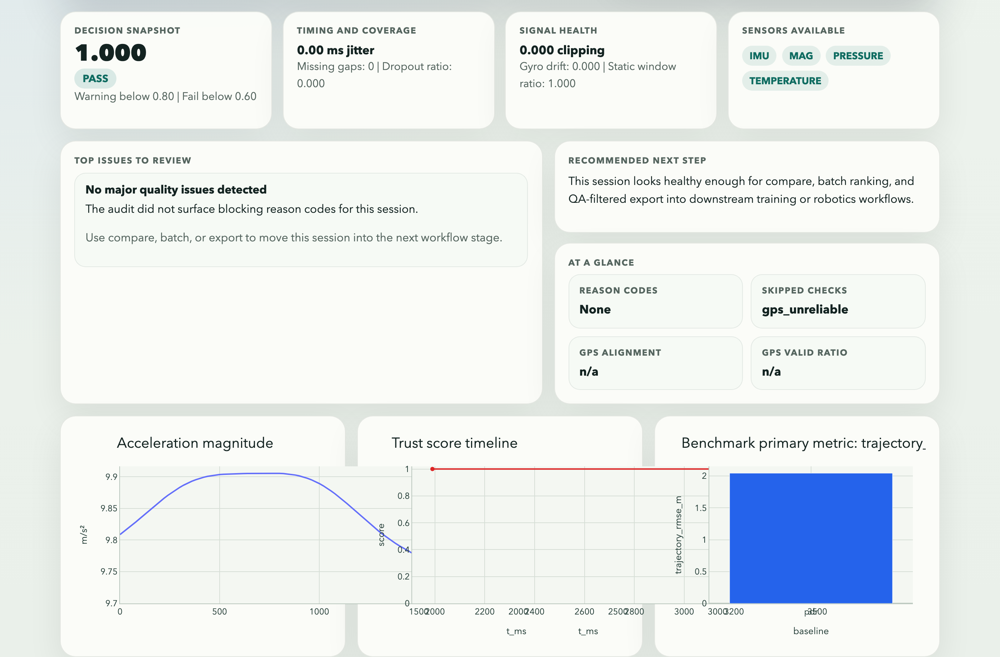
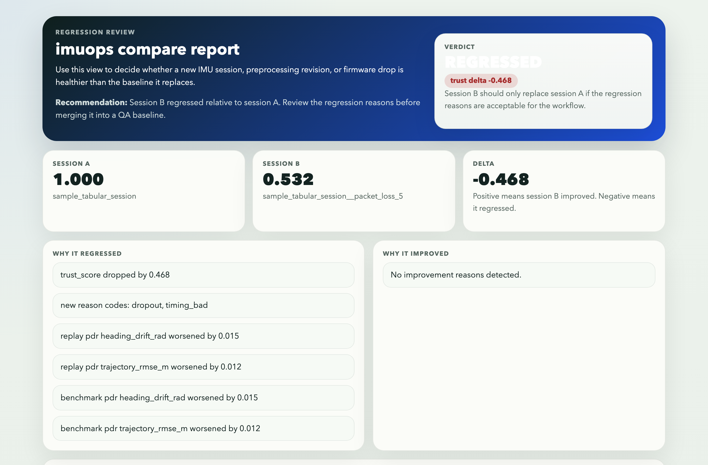

# imuops

[](https://github.com/bozliu/imuops/releases/latest)
[](https://pypi.org/project/imuops/)
[](https://github.com/bozliu/imuops/blob/main/pyproject.toml)
[](https://github.com/bozliu/imuops/actions/workflows/ci.yml)
[](https://github.com/bozliu/imuops/blob/main/LICENSE)

`imuops` is a tabular-first IMU QA and reliability workflow for robotics, wearables, and embedded sensor teams.

It helps teams answer one operational question before they train, benchmark, compare, or ship: can we trust this IMU session, what is wrong with it, and what should we do next?

## What It Is

`imuops` ingests messy `csv`, `tsv`, or `parquet` IMU files, normalizes them into a canonical session, audits sensor quality, computes an explicit `trust_score`, and emits shareable HTML plus machine-readable JSON artifacts.

## Why It Matters

Many downstream model or navigation failures are actually data failures: timestamp jitter, packet loss, clipping, unit mismatch, magnetic disturbance, or inconsistent session quality. `imuops` turns those hidden problems into named reasons before a team burns time debugging the wrong layer.

## What Makes `imuops` Different

Most adjacent tools stop at device drivers, plotting, notebook cleanup, or downstream training. `imuops` adds the workflow layer between raw logs and algorithms:

- tabular-first ingest for customer-shaped data, not just one benchmark layout
- reason-coded `trust_score` artifacts that explain why a session degraded
- `compare`, `batch`, and `export` commands built for regression review and CI
- HTML and JSON outputs that teammates can inspect without rerunning your notebook

## Value


Fewer wasted training runs, faster root-cause diagnosis, cleaner handoff into PyTorch or ROS workflows, and auditable QA evidence in pull requests or release checks.

## Workflow Story

`imuops` is strongest when it sits in the middle of a team workflow:




This embedded GIF is a short preview of the public alpha workflow, from trust diagnosis to shareable evidence to regression review. Full demo asset: [workflow-hero.mp4](https://github.com/bozliu/imuops/releases/download/v0.4.1/workflow-hero.mp4). GIF teaser: [workflow-hero.gif](https://github.com/bozliu/imuops/releases/download/v0.4.1/workflow-hero.gif).

### 1. Diagnose trust before bad data poisons downstream work

[](https://github.com/bozliu/imuops/releases/download/v0.4.1/audit_summary.json)

This shows the first-pass audit summary and the trust-score breakdown that tells you where a session failed.

Teams care because timestamp jitter, clipping, packet loss, or missing signals stop being vague suspicions and become named, reviewable failure reasons. Full artifact: [audit_summary.json](https://github.com/bozliu/imuops/releases/download/v0.4.1/audit_summary.json).

### 2. Turn QA into evidence teammates can inspect

[](https://github.com/bozliu/imuops/releases/download/v0.4.1/report.html)

This shows the interactive HTML report that combines trust-score evidence, timing checks, sensor plots, and benchmark context in one shareable artifact.

Teams care because data quality stops living in one engineer's notebook and becomes something a reviewer, manager, or design partner can inspect directly. Full artifact: [report.html](https://github.com/bozliu/imuops/releases/download/v0.4.1/report.html).

### 3. Decide whether a data-path change regressed the session

[](https://github.com/bozliu/imuops/releases/download/v0.4.1/sample_tabular_compare.html)

This shows a before-vs-after compare view for regression review, trust-score deltas, and summary recommendations.

Teams care because it makes CI and pull-request review practical: if a data pipeline change made the session worse, the artifact says why. Full artifacts: [sample_tabular_compare.html](https://github.com/bozliu/imuops/releases/download/v0.4.1/sample_tabular_compare.html) and [sample_tabular_compare.json](https://github.com/bozliu/imuops/releases/download/v0.4.1/sample_tabular_compare.json). Once a session passes review, teams can export validated windows with `imuops export ... --profile qa_filtered`.

## Install

Requires Python 3.11+.

Primary install path:

```bash
python -m pip install imuops
```

Contributor or source install:

```bash
git clone https://github.com/bozliu/imuops.git
cd imuops
python3.12 -m venv .venv
source .venv/bin/activate
pip install .
```

Use any Python 3.11+ interpreter available on your machine. Maintainer-side validation in this workspace uses the `dl` conda environment, but public users should prefer a clean `venv`.

## Quickstart

After install, the offline first-run path is exactly three commands:

```bash
imuops ingest tabular examples/sample_tabular_imu.csv --config examples/sample_tabular_config.yaml --out output/sample_tabular_demo
imuops audit output/sample_tabular_demo --summary-format markdown
imuops report output/sample_tabular_demo --out output/sample_tabular_demo/report.html
```

You can also use the bundled demo wrapper:

```bash
bash examples/run_tabular_demo.sh
```

## Core Commands

```bash
imuops ingest tabular /path/to/session.csv --config /path/to/mapping.yaml --out output/session_a
imuops audit output/session_a --fail-below 0.80 --summary-format markdown
imuops export output/session_a --profile qa_filtered --format parquet --out output/session_a_clean
imuops compare output/session_a output/session_b --out output/compare.html --json-out output/compare.json --fail-on regression
imuops batch audit output --out output/batch_artifacts
imuops batch validate-trustscore output --out output/trustscore_batch
```

## GitHub Action

`imuops` ships a reusable GitHub Action from this repo:

```yaml
- uses: bozliu/imuops@v0.4.1
  with:
    data_glob: data/**/*.csv
    tabular_config: examples/sample_tabular_config.yaml
    report_dir: output/pr_review
    comment_mode: summary
```

The action emits:

- `trust_score`
- `status`
- `summary_json`
- `report_html`
- `compare_json`
- `comment_markdown`

See [.github/workflows/pr_tabular_review.yml](.github/workflows/pr_tabular_review.yml) for the sample PR workflow.

## Data Provenance

`imuops` is developed and demonstrated using three data-source categories:

- bundled public sample data in [examples/sample_tabular_imu.csv](examples/sample_tabular_imu.csv), which is a synthetic demo dataset created for the public ingest, audit, and report workflow
- public benchmark datasets such as RoNIN, OxIOD, and WISDM, which are supported by adapters but are not redistributed in this repo
- non-distributed historical legacy logs used only as local regression fixtures for parser and adapter work

No private raw historical dataset is required to use the public alpha. Reports that are shared outside your team should typically use `--redact-source-path --redact-subject-id`. See [docs/datasets.md](docs/datasets.md) for the full provenance and redistribution notes.

## What This Release Is

- a tabular-first IMU QA workflow that outside users can install and run without hand-holding
- a trust-score, compare, batch, and export workflow built for team review and CI use
- a truthful public alpha with release-level validation artifacts and explicit known limitations

## What This Release Is Not

- a claim of deployment-grade calibration across every device or dataset
- unbounded replay or benchmark support for arbitrarily large sessions
- a hosted service or finished enterprise platform

## Docs

- [Architecture](docs/architecture.md)
- [Datasets](docs/datasets.md)
- [Trust Score](docs/trustscore.md)
- [Trust-Score Validation](docs/trustscore_validation.md)
- [Schema Compatibility](docs/schema_compatibility.md)
- [Release Checklist](docs/release.md)
- [Contributing](CONTRIBUTING.md)

## License

[MIT](LICENSE)
